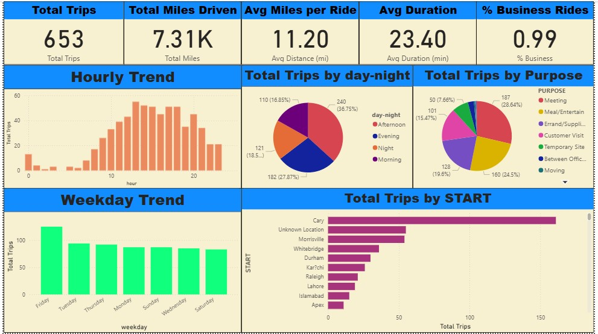

# 🚖 Uber Trips Data Analysis

## 📌 Project Overview

This project analyzes Uber ride data to uncover how rides are used, when demand peaks, and what drives travel behavior. Using Python for cleaning & exploration and Power BI for visualization, we deliver actionable insights for optimizing travel policies and costs.

The final deliverable is an interactive Power BI dashboard that allows stakeholders to explore trip patterns by time, purpose, category, and location.

## 🎯 Business Problem & Goals
 Key Questions:

  - When do rides peak (hour, weekday, month)?

  - Why are people traveling (purpose)?

  - What’s the split between Business and Personal rides?

  - Are trip distance and duration correlated?

  - Do Business vs Personal rides differ materially?

  - Which start/stop locations are most frequent?

KPIs to Track:

 - 🚘 Total trips, total miles

 - 📊 % Business vs. Personal rides

 - 📏 Avg distance & duration

 - 🎯 Top purposes, top pickup locations

- 📈 Ride trends over time

## 🛠 Tech Stack  

### Core Language  
- **Python 3.x**  

### Libraries Used  

- **Data Processing & Cleaning**  
  - `pandas` – dataset manipulation  
  - `numpy` – numerical operations  

- **Visualization**  
  - `matplotlib` – static plots  
  - `seaborn` – advanced statistical plots  

- **Statistics & Tests**  
  - `scipy` – t-tests, chi-square, correlation  

- **Machine Learning Utility**  
  - `scikit-learn` (`OneHotEncoder`) – categorical encoding for correlations  

## 📂 Dataset

- **File:** `uber_clean.csv`  

- **Records:** 653 rides (cleaned from raw dataset)  

- **Columns Include:**  
  - `START_DATE`, `END_DATE` → Trip times  
  - `MILES`, `DURATION` → Trip distance & duration  
  - `CATEGORY` → Business vs. Personal  
  - `PURPOSE` → Travel purpose (Meeting, Customer Visit, etc.)  
  - `START`, `STOP` → Pickup & drop-off locations  
  - **Engineered features:** Hour, Weekday, Month, Time-of-Day bucket  

## 📂 Data Workflow  

1. **Cleaning & Preprocessing**  
   - Replaced missing values, fixed date formats, dropped invalid rows  
   - Extracted new features: trip duration, weekday, month, hour, day-night buckets  

2. **Exploratory Data Analysis (EDA)**  
   - Distribution of Business vs Personal rides  
   - Purposes of travel (Meeting, Customer Visit, Meal, etc.)  
   - Ride peaks by weekday & month  
   - Correlation between miles and duration  

3. **Hypothesis Testing**  
   - **Miles vs Duration** → strong positive correlation (r ≈ 0.91)  
   - **Business vs Personal distance** → no major difference (p > 0.05)  
   - **Purpose vs Category** → highly dependent (p < 0.001)  

## 📊 Key Insights

- Business rides dominate over personal trips (~70% vs 30%).

- Meetings & Customer Visits are the top purposes.

- Fridays and December see the highest ride volumes.

- Most trips are short (< 40 miles) but still significant in frequency.

- Miles & Duration are strongly correlated – longer trips take proportionally more time.

## 📈 Visualizations

📊 Pie charts → Business vs Personal rides, Purpose distribution

📉 Bar chart → Rides by weekday (peaks on Friday)

🔥 Line chart → Monthly ride trends (December spike)

📦 Heatmap → Feature correlations

## 📊 Dashboard Preview  

Here’s a snapshot of the Power BI dashboard built in this project:  

